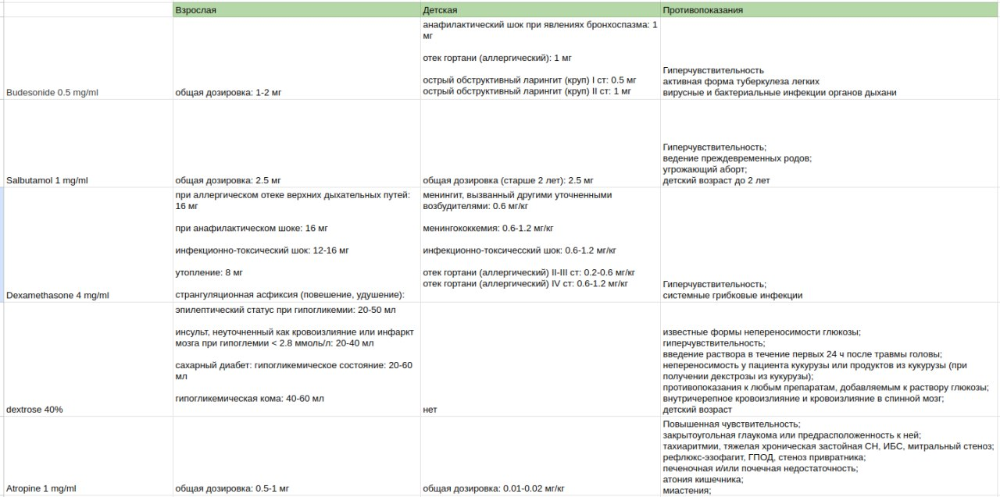

# АВТОМАТИЗАЦИЯ ДОЗИРОВАНИЯ ЛЕКАРСТВЕННЫХ ПРЕПАРАТОВ: РАЗРАБОТКА ВИДЖЕТА КАЛЬКУЛЯТОРА ДОЗИРОВОК ДЛЯ ПОВЫШЕННОЙ ТОЧНОСТИ И БЕЗОПАСНОСТИ
## Выявление технических требований, сбор данных и создание макета
Поскольку ни у кого из команды разработчиков не было опыта работы в составе бригады скорой помощи, нам было необходимо общаться с представителем целевой аудитории, для которой предназначено наше web-приложение ОНМП. Таким образом, мы смогли выяснить основные трудности, с которыми ежедневно сталкиваются врачи в составе бригад.

Во время первой встречи медик подробно рассказал о сложностях, с которыми он сталкивается в своей работы, а также о решениях и стратегиях, которыми он прибегает для облегчения своей жизни и оптимизации процесса оказания помощи. Так выяснились несколько важных моментов.

1. На сегодняшний день карта вызова не имеет единого шаблона заполнения. И это является большой проблемой, так как это юридический медицинский документ, который обязаны заполнять все бригады скорой помощи после окончания вызова. Она имеет определенный стандарт заполнения, утвержденный приказом Минздравсоцразвития России от 02.12.2009г. №942 «Об утверждении статистического инструментария станции (отделения), больницы скорой медицинской помощи». Также возможны требования приказов по Станции, которые также надо учитывать. Каждая карта вызова проходит проверку главным врачом на предмет соответствия стандартам и требованиям. В случае обнаружения нарушений происходит переписывание карты с прилагающимся объяснение причины повторного заполнения.\
Для того, чтобы уменьшить количество ошибок, связанных с государственными стандартами заполнения этого документа, подстанция может в составить собственный шаблон карты, который врачи будут использовать в качестве основы.

2. Заполнение данных карт вызовов происходит вручную. Это неудобно как с точки зрения самого процесса написания карты, который часто происходит в некомфортных условиях (например, <<на коленке>> в движущейся машине скорой помощи с отсутсвием нормального освещения), но и с точки зрения переписывании карт в случае, если они не прошли проверку главным врачом. К тому же, бумага не является наиболее надежным материалом, так как ее легко можно помять, порвать или потерять.

3. Сложности расчета дозировок препаратов. На практике нередки случаи, когда на вызов к ребенку приезжает взрослая бригада скорой помощи. Поэтому медики должны оказать квалицифированную помощь вне зависимости от того, что пациент не входит в возрастную группу, на работу с которыми направлена данная бригада. И основная сложность для врача взрослой бригады скорой помощи в работе с детьми заключается именно в том, какие именно дозировки необходимо дать пациенту. В отличии от взрослых дозировок, которые едины вне зависимоси от каких-либо физиологических параметров человека, детские дозировки напрямую зависят от возраста и веса ребенка. Помимо этого, некоторые препараты противопоказаны детям из-за негативного влияния на организм или по причине отсутствия доказанной исследованиями эффективности и безопасности использования лекарственного средства.\
Однако врач -- это также и человек, и он не всегда может гарантировать, что стресс или физическая усталость не окажут влияния на его работу. Эмоциональные переживания, связанные с работой, или длительные смены в более чем 20 часов могут привести к забыванию правильной дозировки, либо к ошибкам в расчетах. Такие просчеты могут привести к передозировке, которая может иметь серьезные последствия для здоровья пациента. Для избежания подобных случаев многие врачи возят с собой какую-то <<шпаргалку>>, в которой прописано то, как именно производить расчет детскизх дозировок.

Проанализировав полученную информацию об основных сложностях работы в составе бригады скорой помощи, мы с медиком-консультантом стали составлять требования к функционалу виджета калькулятора дозировок.

Виджет калькулятора дозировок несет в первую очередь функцию <<подсказки>> для медика. Поэтому он должен давать рекомендации по дозировкам исходя из физиолоических параметров пациента (возраст и вес) и его диагноза. Помимо этого информацию нужно дополнить информацией о противопоказаниях к применению препарата, так как некоторые лекарственные средства могут быть опасны для жизни больного или несовместимы с какими-то заболеваниями.

На подстанции, на которой работает консультирующих врач, есть шаблон карт вызовов, который наша команда разработчиков решила использовать в своей реализации. Там присутствует пункт под названием <<Оказанная помощь и ее эффект>>, куда заносится также информация о препаратах, которые были использованы в ходе вызова. Благодаря тому, что на странице калькулятора дозировок присутствуют весь список лекарственных средств, мы можем упростить процесс занесения данных об использованных препаратах в карту. Однако стоит учесть то, что дозировки, даваемые калькуляторам, несут лишь рекомендационный характер, и окончательное решение всегда принимается врачом. Поэтому должна быть предусмотрена возможность для пользователя редактировать дозировку, чтобы учитывать индивидуальные особенности и потребности пациента.

Для простоты поиска врачом лекарственных средств по всему имеющемуся перечню, которым оснащена бригада, будет добавлен поиск по названию препарата.

Так как врач-консультант работает в составе взрослой бригады неотложной скорой помощи, то в качестве источника данных он смог предоставить утвержденный Подстанцией список лекарственных средств, которые имеются в составе его бригады. Также он поделился ссылкой на телеграм-бота, откуда можно было брать алгоритмы оказания помощи. Для получения исчерпывающей информации по любому препарату мне предложили использовать сайтом РЛС -- регистра лекарственных средств России.

Так как приложение ОНМП реализуется сразу несколькими разработчиками, то встал вопрос о том, как добиться единой стилистики и общего внешнего вида конечного продукта. Для этого командой разработки было принято решение о создании макета интерфейса.

Макеты интерфейса создаются для того, чтобы понять, как будет выглядеть готовый продукт, и какие элементы будут в него входить. Они позволяют увидеть перед собой будущий интерфейс и визуализировать его, понять, какие изменения и улучшения могут быть внесены в дальнейшей разработке. Также создание макета помогает удостовериться, что все участники команды понимают требования и ожидания заказчика, а также сократить время и издержки на исправление ошибок в дальнейшем.

Для разработки интерфейса ОНМП мы использовали онлайн-сервис Figma, где был создан общий проект, куда каждый frontend-разработчик размещал макет для своей части функционала. После завершения отрисовки, готовые макеты были представлены консультующему врачу для утверждения. В рамках данной работы был реализован следующий макет виджета калькулятора дозировок:

После этого началась работа с данными, полученные от врача-консультанта и поиск недостающей информации.

В процессе изучения списка лекарственных средств, входящие в оснащение взрослой бригады неотложной скорой помощи, выяснилось несколько особенностей. В-первых, списке оснащения бригады перечислены названия не лекарств, а действующих веществ, что надо учитывать при поиске данных. Во-вторых, при занесении информации об использованных препаратах в карту вызова, действующие вещества должны быть указаны на латыни в родительном падеже, что также стоит учитывать при сборе данных.

Для всех лекарственных препаратов были найдены противопоказания на сайте РЛС. Совместно с врачом-консультантом для некоторых диагнозов из противопоказаний были применены аббревиатуры, чтобы сделать чтение этой информации более удобной для специалиста. Например, термин <<атриовентрикулярная блокада>> был сокращен до <<АВ блокада>>, а <<хроническая сердечная недостаточность>> -- до <<ХСН>>.

Далее необходимо было изучить 15 pdf-файлов, в которых описаны алгоритмы оказания помощи. Все они разделены по разделам медицины: <<Хирургия>>, <<Педиатрия>>, <<Анастезиология и реаниматология>> и другие. В них нас интересует лишь 2 столбца: <<Диазноз>> и <<Объем медицинской помощи>>. Столбец <<Объем медицинской помощи>> содержит информацию о том, какие медицинские мероприятия должны быть проведены для оказания врачебной помощи, а также какие лекарственные препараты и в каком объеме должны быть предоставлены пациенту, и каким образом их следует вводить. Пробегаясь по каждому диагнозу, мы сравниваем препараты, используемые в алгоритме лечения, с теми, которые имеются в оснащении бригады. В случае совпадения будем запоминаем эту пару <<диагноз -- дозировка>>.

Нужно отметить, что детские дозировки имеют свои особенности. Если взрослые дозировки препаратов остаются неизменными, независимо от физиологических параметров пациента, то детские дозировки напрямую связаны с либо возрастом, либо весом пациента, в зависимости от лекарства. Однако есть некоторые препараты-исключения, как, например, Будесонид в нашем случае.

После тщательного анализа всех документов я составила таблицу, которая содержит все найденные данные. При более пристальном взгляде на таблицу можно заметить, что некоторые лекарственные препараты не меняют своей дозировки от диагноза к диагнозу. Чтобы упростить восприятие данных для пользователя, я объединила эти диагнозы в одну категорию <<общая дозировка>>.

Таким образом получилась такая конечная таблица: (пока только фото)

На основе получившейся таблицы составляем модель данных, которая будет использоваться в базе данных для хранения и передачи информации о препаратах. Для удобства и точности, я решила вынести понятия, такие как меры дозировок лекарств и параметры, влияющие на детскую дозу, в тип enum, так как они могут принимать только определенные значения. Также для удобства пары <<диагноз - дозировка>> были вынесены в отдельный тип данных DosesAtDiagnosis. Противопоказания будут возвращаться в виде массива, состоящий из противопоказаний, представленных строками.

    const enum Measure = {
        Mg = 'mg',
        Ml = 'ml',
        ME = 'ME',
        Drop = 'drop'
    }

    const enum CalculationParametr = {
        Age = 'age',
        Weight = 'weight'
    }

    interface DosesAtDiagnosis {
        readonly diagnosis: string;
        readonly dose: number;
    }

    interface Medication {
        readonly id: number;
        readonly name: string; // название на латыни в именительном падеже
        readonly nameGenitiveCase: string; // название на латыни в родительном падеже
        readonly measure: Measure; // мера дозировки препарата
        readonly adultDosage: ReadonlyArray<DosesAtDiagnosis>; // взрослые дозировки
        readonly childDosage: ReadonlyArray<DosesAtDiagnosis>; // детские дозировки
        readonly childCalculationParametr: CalculationParametr; // физиологический параметр, по которому будет производиться расчет детской дозировки
        readonly contraindications: ReadonlyArray<string>; // список противопоказаний
    }

## Выбор стека технологий для разработки виджета калькулятора дозировок

История развития разработки web-приложений началась еще в 1991 году с появления World Wide Web (WWW), где 6 августа был размещен первый сайт, написанный на HTML. Первое время страницы состояли почти польностью из текста. Скорость интернета была медленной, и сайты старались делать как можно легче для их более быстрой загрузки. В середине 90-х появилась табличная верстка, которая позволяла создавать страницы с графическими элементами, ставшая началом упорядоченного структурирования страниц. В начале нового века получило широкое распространение CSS, позволяющее разделить дизайн и содержание страницы, что уменьшило количество кода и время загрузки web-страницы.

Начиная с 2005 года настала эпоха Web 2.0, в основе которого лежит принцип активного привлечения пользователей к проектам и сервисам для их развития и улучшения. Появился Ajax, ставший широко используемым инструментом для динамического обновления содержимого веб-страниц. С его развитием связывают и распространение JavaScript(JS). Браузеры стали основной платформой доставки приложений, а JS используется в клиентской части web-приложений, где клиентом является браузер. Так JavaScript по сей день остается одним из самых популярных языков программирования, конкурируя с Python, Golang и прочими.

С 2004 года для JS из-за роста популярности языка стали появляться различные библиотеки для простоты и удобства разработки: Dojo (2004), Dojo Toolkit (2005), JQuery (2005), MooTools (2007), Knockout (2010) и т.д. Со временем появилась потребность создавать большие web-приложения для крупных команий, для которых были созданы такие фреймворки, как Backbone.js (2010), Ember.js (2011), React (2013), Vue.js (2014), Angular (2016) и прочие. Для простоты управления различными пакетами, необходимыми для разработки, были созданы менеджеры пакетов: Bower (2012) и npm (2014). Также были созданы специальные программы, называемые сборщиками модулей, которые помогают решать различные проблемы, связанные с созданием программного обеспечения. Например, Browserify (2011), Webpack (2014) и Grunt (2016) являются примерами таких программ.

Использование классической связки трех языков HTML, CSS и JS не всегда является лучшим вариантом для разработки клиентской части веб-приложения. Процесс разработки при использовании этой связки начинается с нуля, что может затруднить и замедлить работу. Вместо этого, для разработки клиентской части приложения ОНМП командой разработчиков было принято решение использовать современную библиотеку JavaScript, которая обеспечит быструю и удобную разработку,  ориентируясь на практики, применяемые в крупных проектах.

По статистике использования JavaScript библиотек на сегодняшний день 77,8\% web-страниц написаны с помощью библиотеки JQuery, что делает ее наиболее распространенной библиотекой. Вторым по популярности являетcя библиотека Bootstrap с долей в 21,3\%. Однако, при сравнении динамики популярности поисковых запросов этих двух библиотек с тремя фреймворками -- Angular, React и Vue -- мы можем заметить, что после достижения пика популярности в марте 2012 года, библиотека JQuery постепенно утрачивает свою актуальность, как и Bootstrap, уступая место современным фреймворкам.

Существуют несколько причин подобного падения популярности таких библиотек как JQuery и Bootstrap. Во-первых, они не предоставляют возможности легко разделать пользовательский интерфейс на компоненты. Однако это могут делать соверменные фреймворки, так как они спроектированы так, чтобы обрабатывать отрисовку и обновление страницы, в отличие от jQuery и Bootstrap, которая обычно используется только для обновления, возлагая на сервер задачу предоставления начальной страницы.

С другой стороны, компоненты React, Vue и Angular объединяют HTML, код и CSS в единый блок, что позволяет разделить как кодовую базу, так и интерфейс на множество самодостаточных компонентов, которые можно переиспользовать, что упрощает сборку и сопровождение сложных веб-приложений.

Еще одним преимуществом более новых фреймворков является их декларативная парадигма, которая позволяет разработчику описать, как должен выглядеть интерфейс, а выполнение всех необходимых изменений в реальном времени делегирует на фреймворк. Такой подход противоречит императивной концепции, которая характерна JQuery-коду, и упрощает разработку, позволяя сосредоточиться на описании желаемого результата, а не на конкретных действиях, которые необходимо выполнить.

В качестве вариантов фреймворков для разработки были рассмотрены React и Angular, поскольку они, согласно согласно данным Stack Overflow Developer Survey, являются наиболее популярными фреймворками среди разработчиков.

Angular - это платформа для разработки, выпущенная компанией Google в 2016 году. Первая версия фреймворка называется AngularJS, однако он имеет ряд существенных различий по сравнению с более поздними версиями. Платформу используют Google, PayPal, Nike, Microsoft и Ubert.

React была создана Facebook в 2013 году как библиотека JavaScript. В ней были включены новшества, упрощающие процесс разработки, одно из которых стало использование компонентно-ориентированной архитектуры, разделяющая проект на логические и функциональные компоненты. Быстро популярность получила именно эта архитектура, что привело к её внедрению в Angular2, разработанную Google. React используют такие крупные компании, как Facebook, Instagram, Netflix и Airbnb. 

Для того, чтобы лучше понимать преимущества и недостатки каждого из вариантов, проведем анализ по нескольким параметрам.

1. Полнота решения\
React предоставляет только компоненты пользовательского взаимодействия. Это дает больше гибкости и вариативности разработки, однако для получения дополнительных функций необходимо подключать сторонние библиотеки.\
Angular же является полноценным фреймворком, который <<из коробки>> предоставляет полную архитектуру приложения, а также включает в себя ряд крошечных библиотек для решения различных задач. Однако это может иметь недостатки, так как часть модулей может остаться неиспользованными и создавать ненужную нагрузку.

2. Используемый язык программирования\
JavaSctipt имеет свои ограничения и недостатки, которые могут оказывать отрицательное влияние на процесс разработки. В частности, слабая типизация и динамическая природа языка часто становятся причинами ошибок в процессе разработки и затрудняют отладку кода. Для решения этих проблем был разработан TypeScript (TS).\
TS -- это скриптовый язык, компилируемый в JS. Он  был разработан Microsoft в 2012 году. Его главное преимущество -- строгая типизация. Она позволяет более подробно описывать свойства и методы объектов и классов, что делает проверку аргументов в методах и функциях более простой и надежной. Это позволяет избежать ошибок, связанных с неверными типами данных, и упрощает процесс разработки. Также это сказывается на повышении читабельности кода.\
В Angular TS используется по умолчанию, в то время как React стандартно работает с JS, хотя при помощи специальных настроек его можно связать с TypeScript. Однако, для упрощения разработки React использует свой собственный синтаксис, называемый JSX. Он позволяет описывать разметку и поведение компонентов в стиле HTML, но с использованием JS-кода.

3. Сложность освоения фреймворка\
React имеет более низкий порог вхождения, чем Angular, потому что он предоставляет более простой и интуитивно понятный синтаксис. Код React выглядит более читаемым и понятным, поскольку он более декларативный и не требует от разработчиков знания большого числа понятий и функций, как в Angular. Кроме того, за React стоит большое и активное сообщество, которое предоставляет множество готовых решений и библиотек, что делает процесс разработки более быстрым и удобным. 

4. Масштабируемость\
React предоставляет только View компонент из Model-View-Controller (MVC), что означает, что остальные компоненты архитектуры приложения нужно настраивать самостоятельно. В неопытных руках это может привести к серьезным проблемам, когда приложение будет разрастаться.\
Angular, в свою очередь, предоставляет полноценную архитектуру и MVC. Он подходит для манипуляций с большим объемом данных и снижает вероятность проблем, связанных с некорректно настроенной архитектурой.

5. Производительность\
Основное различие между React и Angular заключается в том, что React использует виртуальный DOM, а Angular использует инкрементный DOM.\
DOM (Document Object Model) - это программируемый интерфейс для HTML-документов. Он является стандартом W3C и представляет собой древовидную структуру, которая отражает иерархию элементов HTML-документа. DOM обеспечивает доступ к каждому элементу документа и его свойствам, позволяет изменять содержимое страницы, а также реагировать на пользовательские действия. Модель DOM используется в JavaScript для динамического изменения содержимого веб-страниц и создания интерактивных приложений.\
Виртуальный DOM хранит каноническое представление DOM в памяти и позволяет быстро обновлять это представление, что позволяет выполнить повторный рендеринг быстрее.\
Инкрементный DOM хранит каноническое представление DOM в себе и не использует дополнительную память. Это важно для устройств с ограниченным объемом памяти.

6. Популярность\
Более простые технологии часто популярнее, чем более сложные. Например, за последние годы React и Vue стали наиболее популярными фреймворками с наибольшим количеством звезд на Github. В отличие от этого, Angular не так востребован из-за своей сложности. Разработчику нужно хорошо знать особенности фреймворка, чтобы использовать его в проекте, что делает его менее доступным для новичков.

Проанализировав все эти категории, был выбран React, как фреймворк с низким порогом вхождения и вариативностью выбора языка, который будет использован во время разработки (JS, TS или JSX). 

Несколько лет назад, когда стало ясно, что веб-разработчикам необходимы удобные и эффективные инструменты, чтобы ускорить процесс разработки, появились библиотеки готовых компонентов. Первые библиотеки такого типа начали появляться в начале 2010-х годов, но стали популярными только в последние несколько лет благодаря увеличению количества проектов в веб-разработке и росту технологических возможностей. Сегодня такие библиотеки являются неотъемлемой частью процесса разработки веб-приложений и широко используются в различных проектах и компаниях.

Такие библиотеки предоставляют готовые компоненты, такие как кнопки, формы, таблицы и т.д., которые можно легко интегрировать в приложение без необходимости создания всех этих компонентов с нуля. Также, такие библиотеки обычно имеют готовые стили и дизайны, что упрощает создание стилизации для приложения. Примерами для React являются Material-UI, Ant Design, Semantic UI React. В рамках данной работы будет использована библиотека Material-UI.

В качестве сборщика модулей был выбран Webpack, потому что это популярный и мощный инструмент, который обеспечивает максимальную эффективность и производительность приложения. С помощью него можно легко создавать и управлять бандлами модулей JavaScript, а также оптимизировать их использование для повышения производительности приложения. Еще одним важным преимуществом Webpack является его большое и активное сообщество, которое предоставляет множество решений и плагинов для решения различных задач. Это обеспечивает возможность бесперебойной работы с приложением и быстрое реагирование на возможные ошибки и проблемы.

Для повышения читабельности кода, автоматизации его форматирования и приведения его к общему виду во всей кодовой базе, в проект был добавлен форматтер Prettier.

Менеджеры пакетов используются для управления зависимостями и версиями пакетов в веб-приложении. Они позволяют разработчикам устанавливать, обновлять и удалять пакеты из списка зависимостей приложения. Это обеспечивает более удобную и эффективную разработку и управление проектами. Кроме того, менеджеры пакетов также предоставляют дополнительные функции, такие как управление запуском и тестированием приложения, создание и управление пакетами и т.д. Они также позволяют автоматически устанавливать зависимости и обновления для проекта, что упрощает процесс разработки и поддержки приложения в будущем. В данной работе был использован npm (Node Package Manager), который является наиболее популярным выбором для управления веб-приложениями и который может работать с React.
