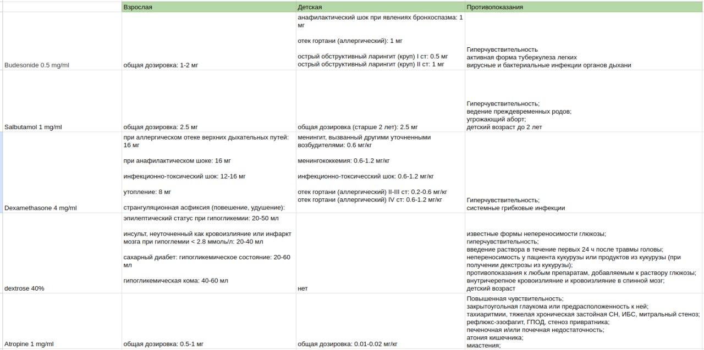

# АВТОМАТИЗАЦИЯ ДОЗИРОВАНИЯ ЛЕКАРСТВЕННЫХ ПРЕПАРАТОВ: РАЗРАБОТКА ВИДЖЕТА КАЛЬКУЛЯТОРА ДОЗИРОВОК ДЛЯ ПОВЫШЕННОЙ ТОЧНОСТИ И БЕЗОПАСНОСТИ
## Выявление технических требований, сбор данных и создание макета
Поскольку ни у кого из команды разработчиков не было опыта работы в составе бригады скорой помощи, нам было необходимо общаться с представителем целевой аудитории, для которой предназначено наше web-приложение ОНМП. Таким образом, мы смогли выяснить основные трудности, с которыми ежедневно сталкиваются врачи в составе бригад.

Во время первой встречи медик подробно рассказал о сложностях, с которыми он сталкивается в своей работы, а также о решениях и стратегиях, которыми он прибегает для облегчения своей жизни и оптимизации процесса оказания помощи. Так выяснились несколько важных моментов.

1. На сегодняшний день карта вызова не имеет единого шаблона заполнения. И это является большой проблемой, так как это юридический медицинский документ, который обязаны заполнять все бригады скорой помощи после окончания вызова. Она имеет определенный стандарт заполнения, утвержденный приказом Минздравсоцразвития России от 02.12.2009г. №942 «Об утверждении статистического инструментария станции (отделения), больницы скорой медицинской помощи». Также возможны требования приказов по Станции, которые также надо учитывать. Каждая карта вызова проходит проверку главным врачом на предмет соответствия стандартам и требованиям. В случае обнаружения нарушений происходит переписывание карты с прилагающимся объяснение причины повторного заполнения.\
Для того, чтобы уменьшить количество ошибок, связанных с государственными стандартами заполнения этого документа, подстанция может в составить собственный шаблон карты, который врачи будут использовать в качестве основы.

2. Заполнение данных карт вызовов происходит вручную. Это неудобно как с точки зрения самого процесса написания карты, который часто происходит в некомфортных условиях (например, <<на коленке>> в движущейся машине скорой помощи с отсутсвием нормального освещения), но и с точки зрения переписывании карт в случае, если они не прошли проверку главным врачом. К тому же, бумага не является наиболее надежным материалом, так как ее легко можно помять, порвать или потерять.

3. Сложности расчета дозировок препаратов. На практике нередки случаи, когда на вызов к ребенку приезжает взрослая бригада скорой помощи. Поэтому медики должны оказать квалицифированную помощь вне зависимости от того, что пациент не входит в возрастную группу, на работу с которыми направлена данная бригада. И основная сложность для врача взрослой бригады скорой помощи в работе с детьми заключается именно в том, какие именно дозировки необходимо дать пациенту. В отличии от взрослых дозировок, которые едины вне зависимоси от каких-либо физиологических параметров человека, детские дозировки напрямую зависят от возраста и веса ребенка. Помимо этого, некоторые препараты противопоказаны детям из-за негативного влияния на организм или по причине отсутствия доказанной исследованиями эффективности и безопасности использования лекарственного средства.\
Однако врач -- это также и человек, и он не всегда может гарантировать, что стресс или физическая усталость не окажут влияния на его работу. Эмоциональные переживания, связанные с работой, или длительные смены в более чем 20 часов могут привести к забыванию правильной дозировки, либо к ошибкам в расчетах. Такие просчеты могут привести к передозировке, которая может иметь серьезные последствия для здоровья пациента. Для избежания подобных случаев многие врачи возят с собой какую-то <<шпаргалку>>, в которой прописано то, как именно производить расчет детскизх дозировок.

Проанализировав полученную информацию об основных сложностях работы в составе бригады скорой помощи, мы с медиком-консультантом стали составлять требования к функционалу виджета калькулятора дозировок.

Виджет калькулятора дозировок несет в первую очередь функцию <<подсказки>> для медика. Поэтому он должен давать рекомендации по дозировкам исходя из физиолоических параметров пациента (возраст и вес) и его диагноза. Помимо этого информацию нужно дополнить информацией о противопоказаниях к применению препарата, так как некоторые лекарственные средства могут быть опасны для жизни больного или несовместимы с какими-то заболеваниями.

На подстанции, на которой работает консультирующих врач, есть шаблон карт вызовов, который наша команда разработчиков решила использовать в своей реализации. Там присутствует пункт под названием <<Оказанная помощь и ее эффект>>, куда заносится также информация о препаратах, которые были использованы в ходе вызова. Благодаря тому, что на странице калькулятора дозировок присутствуют весь список лекарственных средств, мы можем упростить процесс занесения данных об использованных препаратах в карту. Однако стоит учесть то, что дозировки, даваемые калькуляторам, несут лишь рекомендационный характер, и окончательное решение всегда принимается врачом. Поэтому должна быть предусмотрена возможность для пользователя редактировать дозировку, чтобы учитывать индивидуальные особенности и потребности пациента.

Для простоты поиска врачом лекарственных средств по всему имеющемуся перечню, которым оснащена бригада, будет добавлен поиск по названию препарата.

Так как врач-консультант работает в составе взрослой бригады неотложной скорой помощи, то в качестве источника данных он смог предоставить утвержденный Подстанцией список лекарственных средств, которые имеются в составе его бригады. Также он поделился ссылкой на телеграм-бота, откуда можно было брать алгоритмы оказания помощи. Для получения исчерпывающей информации по любому препарату мне предложили использовать сайтом РЛС -- регистра лекарственных средств России.

Так как приложение ОНМП реализуется сразу несколькими разработчиками, то встал вопрос о том, как добиться единой стилистики и общего внешнего вида конечного продукта. Для этого командой разработки было принято решение о создании макета интерфейса.

Макеты интерфейса создаются для того, чтобы понять, как будет выглядеть готовый продукт, и какие элементы будут в него входить. Они позволяют увидеть перед собой будущий интерфейс и визуализировать его, понять, какие изменения и улучшения могут быть внесены в дальнейшей разработке. Также создание макета помогает удостовериться, что все участники команды понимают требования и ожидания заказчика, а также сократить время и издержки на исправление ошибок в дальнейшем.

Для разработки интерфейса ОНМП мы использовали онлайн-сервис Figma, где был создан общий проект, куда каждый frontend-разработчик размещал макет для своей части функционала. После завершения отрисовки, готовые макеты были представлены консультующему врачу для утверждения. В рамках данной работы был реализован следующий макет виджета калькулятора дозировок:

После этого началась работа с данными, полученные от врача-консультанта и поиск недостающей информации.

В процессе изучения списка лекарственных средств, входящие в оснащение взрослой бригады неотложной скорой помощи, выяснилось несколько особенностей. В-первых, списке оснащения бригады перечислены названия не лекарств, а действующих веществ, что надо учитывать при поиске данных. Во-вторых, при занесении информации об использованных препаратах в карту вызова, действующие вещества должны быть указаны на латыни в родительном падеже, что также стоит учитывать при сборе данных.

Для всех лекарственных препаратов были найдены противопоказания на сайте РЛС. Совместно с врачом-консультантом для некоторых диагнозов из противопоказаний были применены аббревиатуры, чтобы сделать чтение этой информации более удобной для специалиста. Например, термин <<атриовентрикулярная блокада>> был сокращен до <<АВ блокада>>, а <<хроническая сердечная недостаточность>> -- до <<ХСН>>.

Далее необходимо было изучить 15 pdf-файлов, в которых описаны алгоритмы оказания помощи. Все они разделены по разделам медицины: <<Хирургия>>, <<Педиатрия>>, <<Анастезиология и реаниматология>> и другие. В них нас интересует лишь 2 столбца: <<Диазноз>> и <<Объем медицинской помощи>>. Столбец <<Объем медицинской помощи>> содержит информацию о том, какие медицинские мероприятия должны быть проведены для оказания врачебной помощи, а также какие лекарственные препараты и в каком объеме должны быть предоставлены пациенту, и каким образом их следует вводить. Пробегаясь по каждому диагнозу, мы сравниваем препараты, используемые в алгоритме лечения, с теми, которые имеются в оснащении бригады. В случае совпадения будем запоминаем эту пару <<диагноз -- дозировка>>.

Нужно отметить, что детские дозировки имеют свои особенности. Если взрослые дозировки препаратов остаются неизменными, независимо от физиологических параметров пациента, то детские дозировки напрямую связаны с либо возрастом, либо весом пациента, в зависимости от лекарства. Однако есть некоторые препараты-исключения, как, например, Будесонид в нашем случае.

После тщательного анализа всех документов я составила таблицу, которая содержит все найденные данные. При более пристальном взгляде на таблицу можно заметить, что некоторые лекарственные препараты не меняют своей дозировки от диагноза к диагнозу. Чтобы упростить восприятие данных для пользователя, я объединила эти диагнозы в одну категорию <<общая дозировка>>.

Таким образом получилась такая конечная таблица: (пока только фото)

На основе получившейся таблицы составляем модель данных, которая будет использоваться в базе данных для хранения и передачи информации о препаратах. Для удобства и точности, я решила вынести понятия, такие как меры дозировок лекарств и параметры, влияющие на детскую дозу, в тип enum, так как они могут принимать только определенные значения. Также для удобства пары <<диагноз - дозировка>> были вынесены в отдельный тип данных DosesAtDiagnosis. Противопоказания будут возвращаться в виде массива, состоящий из противопоказаний, представленных строками.

    const enum Measure = {
        Mg = 'mg',
        Ml = 'ml',
        ME = 'ME',
        Drop = 'drop'
    }

    const enum CalculationParametr = {
        Age = 'age',
        Weight = 'weight'
    }

    interface DosesAtDiagnosis {
        readonly diagnosis: string;
        readonly dose: number;
    }

    interface Medication {
        readonly id: number;
        readonly name: string; // название на латыни в именительном падеже
        readonly nameGenitiveCase: string; // название на латыни в родительном падеже
        readonly measure: Measure; // мера дозировки препарата
        readonly adultDosage: ReadonlyArray<DosesAtDiagnosis>; // взрослые дозировки
        readonly childDosage: ReadonlyArray<DosesAtDiagnosis>; // детские дозировки
        readonly childCalculationParametr: CalculationParametr; // физиологический параметр, по которому будет производиться расчет детской дозировки
        readonly contraindications: ReadonlyArray<string>; // список противопоказаний
    }