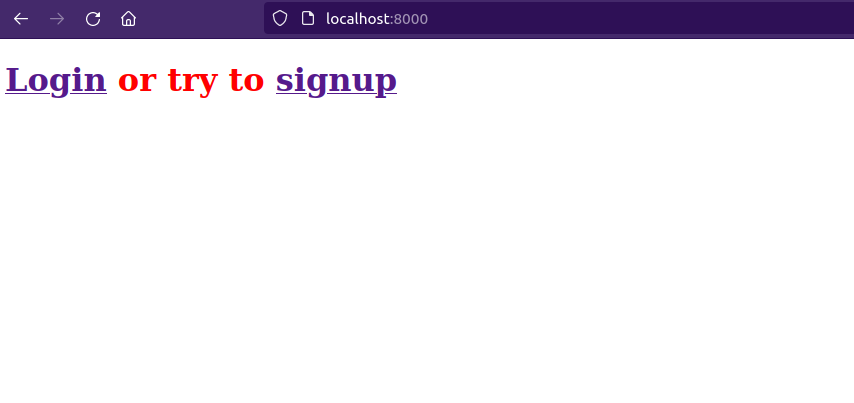

# Инструкция для всего

- [Как поставить локальный сервер](#как-поставить-локальный-сервер)  
    - [Виртуальное окружение](#3-создаешь-себе-виртуальное-окружение-с-помощью-python3)  
    - [Зависимости](#4-скачать-все-зависимости-из-файла-requirementstxt)  
    - [Переменные окружения](#5-переменные-окружения)  
    - [Миграции](#6-миграции)  
    - [Запуск сервера](#7-запуск-сервера)
- [Дополнительные команды](#дополнительные-команды)  
    - [Создание суперпользователя](#создание-суперпользователя)  
- [Как и куда писать код если я занимаюсь](#как-и-куда-писать-код-если-я-занимаюсь)  
    - [Фронтэндом](#фронтэндом)  
      - [Теги](#есть-2-вида-тегов)
      - [Cпец теги](#список-спец-тегов)
        - [Url](#url)
        - [Static](#static)
        - [Csrf](#csrf)
        - [If](#if)
        - [For](#for)
        - [Block](#block)
        - [Extends](#extends)
    - [Базой данных](#базой-данных)  
    - [Утилитами](#утилитами)  
    - [Мобилками](#мобилками)
- [FAQ](#faq)
# Как поставить локальный сервер
Локальный сервер надо будет настроить один раз
## 1. Скачиваешь весь репозиторий к себе
## 2. Заходишь в папку **src/dev/**
## 3. Создаешь себе виртуальное окружение с помощью Python3
Прописываешь команду в консоль
```bash
python3 -m venv venv
```
После этого появляется папка venv. В окружение надо зайти командой
> Linux
```bash
. venv/bin/activate
```
> Windows - возможно стоит использовать не activate, а activate.bat, но здесь мне уже сложно что-то подсказать, я на линуксе, однако я помогал уже настроить Владу на 10 винде + ставил у себя на 7-ку, все работало
```bash
venv\Scripts\activate
```
## 4. Скачать все зависимости из файла requirements.txt
```bash
pip install -r requirements.txt
```
На этом этапе я сталкивался с проблемой несоответствия версии, в таком случае скачай вручную все проблемные пакеты, для этого внимательно читай название ошибки и соответствующего пакета. Скачивание вручную выглядит так __pip install {package}__. Например на win7 самая новая версия django - 3, когда уже вышла 4.1. Поэтому после возникновения ошибки, я скачиваю джанго вручную
```bash
pip install django
```

Дополнительно можешь вписать для проверки
```bash
pip list
```
и сравнить скачанные пакеты с требуемыми из requirements.txt

## 5. Переменные окружения
Django использует секретные данные, поэтому класть их просто в репозиторий небезопасно, я скину файл в тг, который каждый из вас должен будет скопировать в __/src/dev__, без него ничего не будет работать.

P.S. Винда не позволяет создавать файлы начинающиеся на ., поэтому при скачивании у вас она заменится, если знаешь как, то замени на __.env__ и закинь, получится __/src/dev/.env__

Если ты не сможешь заменить, то добавь свой файл со своим названием туда же, как сверху, но замени строчку в файле __/config/settings.py__
```python
... 
# Примерно в начале, на данный момент 5 строчка
env.read_env('.env')
# Замени .env на свой файл, например так
env.read_env('document.env')
...
```

## 6. Миграции
Django, используя любую базу данных, требует ее настройки, поэтому при любом изменении бд, потребуется ввести две команды
> Все следующие команды надо писать находясь в виртуальном окружении
```bash
python manage.py makemigrations
python manage.py migrate
```
Запомни, что в любой момент, при любом моем коммите может произойти изменение, поэтому я советую каждый раз, как ты увидишь коммит с префиксом __BCK__ и у тебя не включается сервер, прописать эти две команды выше, они ничего не сломают, если новых миграций не будет, но если они будут, то он их добавит, а сервер будет работать как надо
> Безумие — это точное повторение одного и того же действия раз за разом в надежде на изменение (c) Far Cry 3
## 7. Запуск сервера
Введи в консоль
```bash
python manage.py runserver
```
Если ты все сделал правильно, то ты увидишь такую картинку


Переходи в браузер на одну из ссылок  
* localhost:8000
* 127.0.0.1:8000

Наш сайт запущен


# Дополнительные команды
## Создание суперпользователя
Суперпользователь - это по сути админ, человек, который может зайти в админку, а там уже можно менять все что душе угодно

```bash
python manage.py createsuperuser --email admin@admin.ru
```
Думаю следующие поля будут понятны, пароль советую в разработке вводить предельно простой, если ты будешь заходить в админку чаще.

# Как и куда писать код если я занимаюсь
## Фронтэндом
Для вас есть две папки, в них вы разрабатываете свой код
* static
* templates  

В данной версии уже лежат файлы для примера, в файле static лежат css/js/images, это файлы, которые статичны на нашем сайте
Эта папка принадлежит всем фронтэндерам и только им, правила устанавливаете вы сами для себя
> В будущем(возможно) придется создать еще одну папку с динамическими файлами(обычно это файлы, которые доступны клиенту на сайте) - media  

html-файлы должны храниться __ИСКЛЮЧИТЕЛЬНО__ в папке templates, это важно, здесь уже к вам подключаюсь я, бэкэндер  
Правила расположения файлов очень просты, все глобальные html-ки должны храниться просто в папке templates, если html-ки принадлежат какому-то приложению, то надо продублировать название приложения
> Например в данном примере есть папка приложения account, отвечающая за работу с пользователями, поэтому html страница регистрации, логина и любых других файлов, должны находиться в папке account, а вот home.html является глобальной страницей, поэтому лежит просто в templates

Связь между фронтом и бэком обрабатывается __контекстом__, это по сути список переменных, который я буду перекидывать на фронт, переменные кстати могут быть любым типом. Тебе стоит научиться все типы обрабатывать. Для этого существуют теги.

#### Есть 2 вида тегов
- Специальный тег  - используется процент
- Тег для переменных {{ my_lovely_variable }} - используется фигурная скобка

тег для переменных предельно прост, ты пишешь конструкцию как выше, а внутри требуемую переменную из контекста. Например в файле home.html есть такая строка
```html
Hello, {{ request.user.email }} <br>
```
request - это специальная переменная текущей сессии, которая есть всегда, в ней есть переменная user, а в нем есть email. Такой командой мы можем распутать и взять нужное нам поле

Помимо request могут быть другие переменные из контекста, которые ты также можешь выводить

Кстати, также можно вызывать и методы, например из login.html:
```html
...
{{ form.as_p }}
...
```

Специальные теги посложнее, я постараюсь выделить минимум, который вам понадобится:

### Список спец тегов
### __url__
____ - заменяет стандартную ссылку, в поле href пишешь эту команду вместо 'home' пишешь нужное сокращение для ссылки, думаю в скором времени я создам тег, который будет показывать все пути с их сокращениями. Пример из файла home.html:
```html
...
<a href="">Logout</a>
...
<a href="">Login</a> or try to <a href="">signup</a>
...
```

#### __Static__
____ - подгружает статичные объекты, если вам требуется подгрузить css/js/image из папки статики, то данный тег __обязан__ быть, после этого можно подключить статичный файл такой командой, пример из home.html
```html

...
<script src=""></script>
...
```
> Обрати внимание на строчку ссылки, js - папка из папки static, если у тебя будет файл js лежать в пути static/lol/kek/cheburek/my_lovely_js.js, то и писать в html ты должен 

точно также работают css и image

#### __csrf__
____ - генерирует токен безопасности, который предотвращает CSRF-атаку. Правило использования очень простое - где создаешь форму с __POST__ методом, там и прописываешь этот тег, пример из signup.html
```html
<form method="post">
    
    {{ form.as_p }}
    <button type="submit">Регистрация</button>
</form>
```

#### __if__
____ - думаю интуитивно понятно что здесь происходит, однако этот тег отличается тем, что он закрывающийся, то есть в конце надо прописать еще ____

Пример из home.html
```html

    Hello, {{ request.user.email }} <br>
    <a href="">Logout</a>

    <a href="">Login</a> or try to <a href="">signup</a>

```

Шаблон
```html




```

#### __for__
____ - закрывающий тег цикла, таким образом ты сможешь обработать список например
```html

Item from list: {{ item }} <br>

```
Или словарь
```html

Key: {{ key }} <br>
Value: {{ value }} <br>

```
> Напомню, что можно вызывать методы переменных контекста как в данном примере dict.items

> Еще одна заметка, методы без ()

#### __block__
____ - рано или поздно у нас появится задача создать например navbar или footer, логично, что постоянно в каждой html прописывать одни и те же строки - неправильно, нарушает принцип __DRY__, блок создан для исправления подобной проблемы

Приведу пример, глобальный файл base.html
```html
...
<title>


</title>

<style>
body {
    background-color: red;
}
</style>


Стандартный блок, будет отображен если не использовать block content

...
```
#### __extends__
____ - использует файл выше  
Файл наследователь
```html



Я файл наследователь и я буду расположен в названии вкладки



Переопределенный блок, я же буду отображен

```

Если не переопределять блоки после extends, то будет использовано то, что в глобальной файле

> Без блоков будет сложно, если будут трудности, обращайтесь, я всегда готов объяснить и помочь

## Помощь фронту с тыла
Есть кастомные теги, которые упростят вам работу, например сейчас реализован уже тег, который показывает вам текущий контекст, для подключения кастомного тега надо указать

```html
...

...
```
Теперь можно вызвать тег
```html
...

...
```
Это строки из home.html

Когда заходишь на localhost:8000 тебе в чат пишется контекст, который я передаю c бэка


## Базой данных
Для работы с базой данных стоить обратить внимание на папку dbsetter, туда кидать свои инстуркции sql, желательно в один файл, там должно быть создание нужных таблиц, а также их заполнение

В файл requests.py нужно вписывать __глобальные переменные__ c запросами, их надо использовать только к ручным таблицам, которые ты создашь, остальные таблицы трогать не надо, но если потребуется, то ок

> Более быстрым способом является ограничение и получение значения по средствам sql, поэтому если надо вернуть только ограниченное кол-во элементов лучше использовать LIMIT 2 или другое значение

В файле requests.py есть примеры запросов без параметров и с параметрами, если параметры не повторяются, то лучше использовать ...WITH_LIST_PARAMS, если параметры повторяются, то только ...WITH_DICT_PARAMS

В каждом запросе пиши комментарии перед переменной, две строчки, что означают переменные и что возвращает, еще пиши названия переменных более точно и заглавными буквами

Избегай *, лучше явно прописать все возвращаемые значения
## Утилитами
Для вас есть папка utils, в ней создаете свои, на данный момент я сам создал pdf, думаю понятно, что она для человека, который конвертирует форму в пдф

Так как джанго это питоновский фреймворк, то желательно писать на питоне, но если используете другой язык, то надо соблюдать условия:
- Конечный продкшн уровень будет на linux
- Позаботься о том, как я потом выведу твой вывод фронту и как я тебе передам вводные параметры

Задача сделать так, чтоб я просто вызвал функцию, перекинул параметры и перекинул фотографию, pdf или т.п. фронту, чтоб мне не пришлось писать еще строчки кода
## Мобилками
Ждать api

# FAQ
Здесь будут ответы на некоторые вопросы и сложности